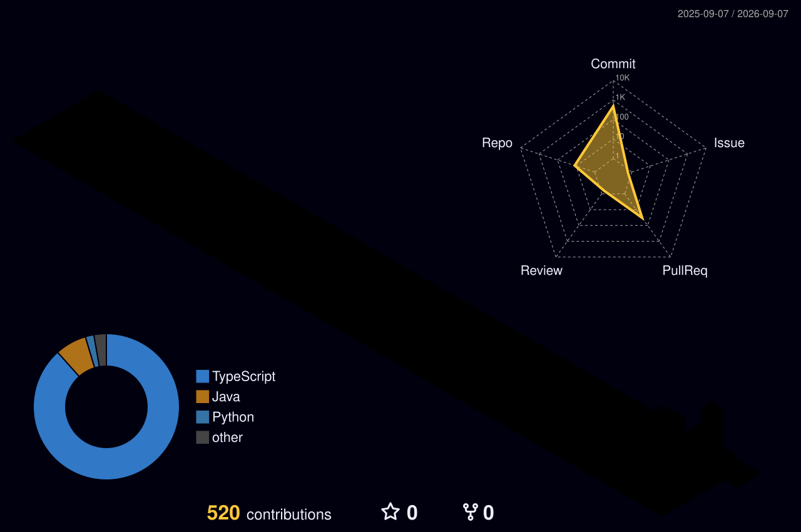

# 💫 About Me:
## 👾 Player Profile: Irish (@przish)  **Class:** Level 2 BS Computer Science Student @ De La Salle Lipa   **Guild:** AWS Learning Club - DLSL   **Status:** *Lock in* ⚡    ### 📜 Current Quests - **[Main Quest]:** Mastering the art of **React Native, Next.js, & TypeScript**. - **[Side Quest]:** Leveling up my backend skills with **Java & Python**. - **[Active Raids]:** Currently building out and pushing commits to [COMMrade](https://github.com/przish/COMMrade), [Traki](https://github.com/przish/traki), and [Jo Creates](https://github.com/przish/project-jo-creates).  ### ⚔️ Arsenal  `TypeScript` `React Native` `Next.js` `Python` `Java`  ### 📬 Contact NPC Let's party up for a collab or talk code: [irish.devv@gmail.com](mailto:irish.devv@gmail.com) | [LinkedIn](https://www.linkedin.com/in/irish-may-pureza)

## 🌐 Socials:
   

# 💻 Tech Stack:
        
# 📊 GitHub Stats:
 
 

